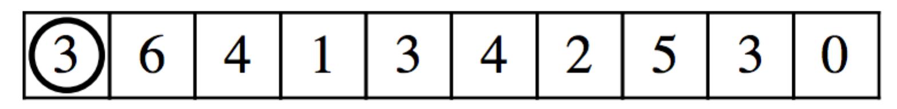

The Slider Puzzle
===================

A slider puzzle consists of a row of squares each of which contains a single digit integer, like this:

A circle marker starts on the initial square on the left and can be moved to other squares along the row. At each step in the puzzle, you may only move the marker the number of squares indicated by the integer in the square it currently occupies, either left or right along the row. The marker may not move past either end of the puzzle. For example, in the puzzle above the only legal first move is to move the marker three squares to the right because there is no room to move three spaces to the left.

The goal of the puzzle is to move the marker to the 0 at the far end of the row, on the right. However, not every puzzle has a valid solution. 
 
Input for this problem will be a number between 1 and 100 inclusive representing the number of puzzles in the input, each puzzle is between 10 and 101 digits long. Each individual puzzle will be on one line and consist of a series of integers separated by spaces. Output should simply state whether "Puzzle N is solvable." or "Puzzle N is not solvable." where N refers to the puzzle instance.

Sample Input
-------------
2
3 6 4 1 3 4 2 5 3 0
3 2 1 1 1 2 2 5 3 0

Sample Output
--------------
Puzzle 1 is solvable.
Puzzle 2 is not solvable.
